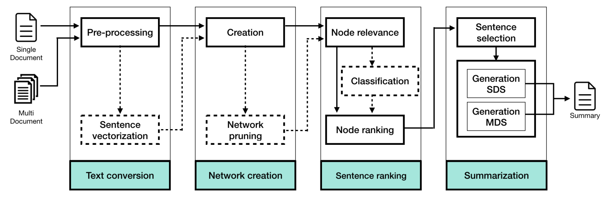
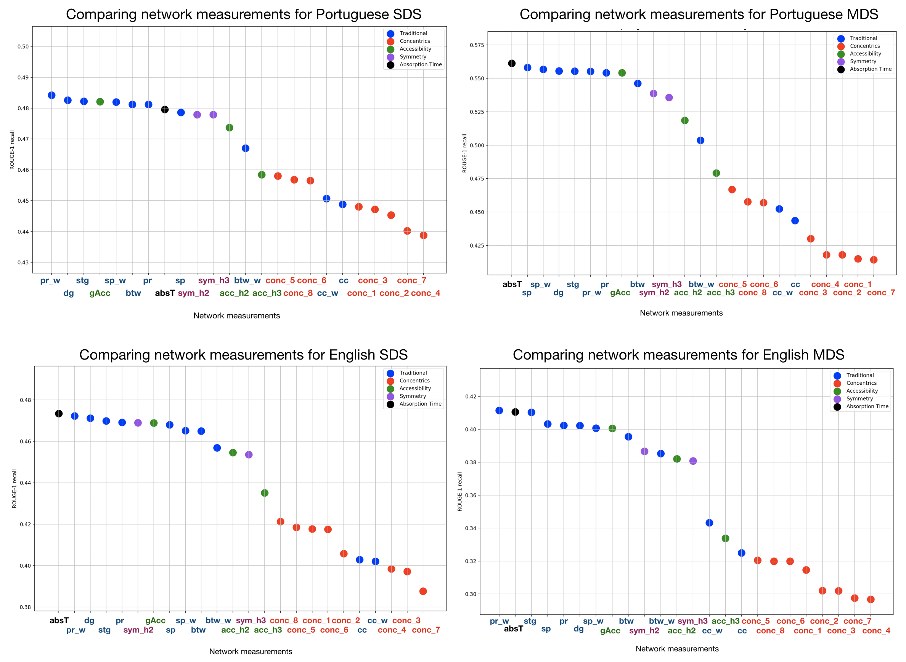

# Text Summarizer
Text summarizer for English and Portuguese documents based on complex networks 

## Datasets
- _TeMário_: This corpus includes a set of 100 Portuguese news texts with their respective summaries. The documents were extracted from the newspapers _Folha de São Paulo_ and _Jornal do Brasil_. 
- _CSTNews_: This corpus presents a set of documents extracted from the following online Brazilian news agencies: _Folha de São Paulo, Estadão, O Globo, Gazeta de povo_, and _Jornal do Brasil_. _CSTNews corpus_ consists of 140 news documents, which are grouped into 50 clusters. Each cluster includes 2 or 3 documents that share the same topic.  
- _DUC 2002_: This corpus includes a collection of 567 English documents divided into 59 clusters. The documents were extracted from the following online news journals: _Financial Times, AP Newswire, San Jose Mercury News, LA Times, FBIS,_ and _Wall Street Journal_

Description | TeMário  | CSTNews | DUC 2002 |
|---- | ---- | --- | --- |
| Goal  | Portuguese SDS  | Portuguese MDS | English SDS-MDS
| Documents  | 100 | 140 | 567
| Clusters | - | 50 | 59 
|Docs. per cluster | - | 2 to 3 | 6 to 10
|Avg. sentences per doc. | 29.37 | 16.8 | 27.92
|Summary size | 70% compression rate | 70% compression rate | 100-200 words 

## Methodology
The methodology is divided into four stages: In the first stage, Text Conversion, the documents are conveniently pre-processed with the aim of modeling each document as a network. In the second stage, Network Creation, a network is created for each pre-processed document from datasets. I proposed the creation of different network models, where each node represents a sentence and the connection between two sentences is established in several ways. In the Sentence Ranking stage, it is employed a set of complex network measurements with the aim of giving a value of importance (relevance weight) to each network node; in this way, the nodes could be ranked. In the last stage, Summarization, the best-ranked sentences (nodes) are selected to belong to the final summary. The architecture of the Automatic Summarization System is shown as follows:

## Main results

## References
[Extractive multi-document summarization using multilayer networks](https://www.sciencedirect.com/science/article/abs/pii/S0378437118303212). JV Tohalino, DR Amancio. Physica A: Statistical Mechanics and its Applications 503, 526-539

[Extractive multi-document summarization using dynamical measurements of complex networks](https://ieeexplore.ieee.org/abstract/document/8247081). JV Tohalino, DR Amancio. 2017 Brazilian Conference on Intelligent Systems (BRACIS), 366-371
